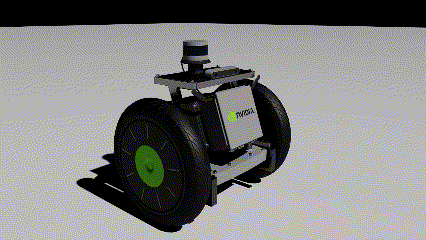
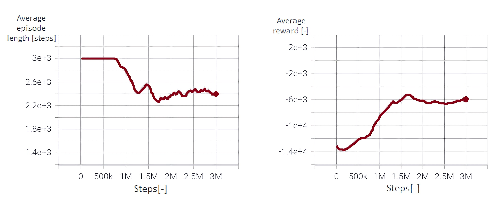

# Readme.md

<p align="center">
  
</p>

<p align="center">
  An easy-to-use library to develop deep reinforcement learning experiments in the Isaac Sim simulator. 
</p>


## Contents

- [Description](#Description)
- [Features](#Features)
- [How to install](#How-to-install)
- [How to use](#How-to-use)
- [Example](#Example)


## Description
<a name="Description"/>

<p align="justify">
  The library aims to conduct experiments and DRL training with mobile robots in a realistic environment using standard libraries such as OpenAi Gym, Pytorch, Isaac Sim extensions, and SB3 in a unified and ready-to-use framework. Furthermore, the library is easy to use, configure, and customize all different robots, sensors, environments, and methods that allow and facilitate research in AI-based mobile robots using Isaac Sim, speeding up time-consuming steps for training expert agents.
</p>


## Features
<a name="Features"/>

#### Environments (scenes)
* Three different flat grids (normal, black and curved).
* A simple, tiny room with a table at the center.
* Four whorehouse of different sizes and obstacles.
* One floor of a hospital building.
* One floor of an office building.
* A custom random obstacle map.

<p align="center">
  
</p>

#### Robots
* Jetbot      (differential).
* Carter V1   (differential).
* Transporter (differential).
* Kaya        (holonomic).

<p align="center">
  
</p>

#### Sensors
* Wheel lineal velocity sensor (encoder).
* Robot’s base lineal velocity sensor (3d velocity magnitude).
* Robot’s base angular velocity (of the yaw angle).
* Customizable RGB camera
* Customizable depth camera
* Customizable Lidar (range sensor).

#### Others
* General methods to control and mesure the robot joints and sensors.
* Example.

## How to install
<a name="How-to-install"/>

#### Requirements
You must hace a computer compatible with Isaac Sim 2021.2.1, please check the [official documentation](https://docs.omniverse.nvidia.com/app_isaacsim/app_isaacsim/requirements.html).

#### Steps
 1. Download this Git.
 2. Copy DRL_Isaac_lib to ~/.local/share/ov/pkg/isaac_sim-2021.2.1


## How to use
<a name="How-to-use"/>

Open a terminal and run the following commands:

#### To train
 1. cd ~/.local/share/ov/pkg/isaac_sim-2021.2.1/DRL_Isaac_lib/
 2. ~/.local/share/ov/pkg/isaac_sim-2021.2.1/python.sh train_d.py

#### To view tensorboard
* ~/.local/share/ov/pkg/isaac_sim-2021.2.1/python.sh ~/.local/share/ov/pkg/isaac_sim-2021.2.1/tensorboard --logdir ./

#### To Watch nvidia-smi in real time
* watch -n0.1 nvidia-smi


## Example
<a name="Example"/>

Three files to train a DQN agent are included to illustrate the usage of the library. These are: 
* env.py
* train.py
* eval.py

The differential robot used is a jetbot. The scene is a random obstacle generator. The goal is to achieve an end position by avoiding different obstacles by utilizing a set of discrete actions. 

```python
class Isaac_envs(gym.Env):
    metadata = {"render.modes": ["human"]}
    
    ## ...

        from isaac_robots  import isaac_robot
        from isaac_envs    import isaac_envs  
        from omni.isaac.core.objects import VisualCuboid

        env_name    = "random_walk"
        robot_name  = "jetbot"
        action_type = "discrete"
        
    ## ...
```

If you want to change the robot, scene, or action type, modify the following parameters:

#### env_name =
* "grid_default"
* "grid_black"
* "grid_curved"
* "simple_room"
* "warehause_small_A"
* "warehause_small_B"
* "warehause_small_C"
* "warehause_full"
* "hospital"
* "office"
* "random_walk"


#### robot_name = 
* "jetbot"
* "carter_v1"
* "kaya"
* "transporter"

#### action_type = 
* "continuous"
* "discrete"

To fast obtain the observation of the environment, the methods created in this work are used:

```python
def get_observations(self):
        ## Camera Data
        # rgb_data   = self.isaac_environments._get_cam_data(type="rgb") ## Custom method
        depth_data = self.isaac_environments._get_cam_data(type="depth") ## Custom method

        ## Lidar Data
        lidar_data = self.isaac_environments._get_lidar_data() ## Custom method
        # for transporter uncomment the next line
        # lidar_data2 = self.isaac_environments._get_lidar_data(lidar_selector=2) ## Custom method

        ## Distance and angular differencess
        goal_world_position, _        = self.goal.get_world_pose()
        d                             = self.robot.distance_to(goal_world_position) ## Custom method
        angle                         = self.robot.angular_difference_to(goal_world_position) ## Custom method
        target_relative_to_robot_data = np.array([ d, angle ])

        ## Robot base's velocities
        real_V = self.robot.get_lineal_vel_base() ## Custom method
        real_W = self.robot.get_angular_vel_base() ## Custom method

        vase_vel_data = np.array([ real_V, real_W])

        obs = {"IR_raleted" : lidar_data, "pos_raleted" : target_relative_to_robot_data, "vel_raleted" : vase_vel_data} 
```

The reward function used is:

$$\begin{linenomath}
\begin{align}
\label{eqn:reward}
r = \left\{\begin{array}{lll}
-d_{t}  \left ( 1 - \frac{step_i}{step_{max}} \right ) &; \text{if goal isn't achieved} \\
-p  &; \text{if robot collides with the obstacle}\\ 
r_{l} \left ( 1 - \frac{step_i}{step_{max}} \right ) &; \text{if robot achieves goal}
\end{array}\right.
\end{align}
\end{linenomath}$$

After 3.000.000 steps, the results are:

<p align="center">
  
</p>


<p align="center">
  
</p>

An evaluation of 30 episodes was made to extract some useful information about the quality of the learned policy $\pi$, the result presented in the next table.

| Parameter        | Value         |
|------------------|---------------|
| Rate of success  |  86.7%        |
| Episode's time   |  27.6 [s]     |
| Episode's steps  |  1619 [steps] |
| Robot trajectory |  504.1 [cm]   |
